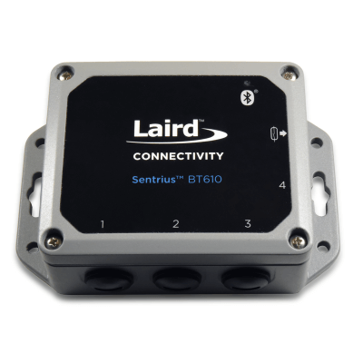

# BT610

Download firmware releases from [here!](https://github.com/LairdCP/)

Laird Connectivity’s Sentrius™ BT610 I/O Sensor with Bluetooth 5 turns your wired sensors into IP67-rated battery-operated wireless nodes, providing robust and secure messaging.  Leveraging our BL654 module, it provides full Bluetooth 5 capabilities, opening up industrial and equipment monitoring applications.

>**Note:** This readme file and associated documentation should be viewed on GitHub selecting the desired branch. The master branch will always be up to date with the latest features. Viewing documentation from a release GA branch is recommended to get documentation for the specific feature set of that release.

The BT610 can operate with differnt sensor configurations:
* [Thermistor Sensors](#thermistor-sensors)
* [AC Current Sensors](#ac-current-sensors)
* [Ultrasonic and Pressure Sensors](#ultrasonic-and-pressure-sensors)

These configurations are selected within the mobile application or by sending a specific message indicating what is connected. See the following sections for documentation on the demo and how it operates.

For more details on the demo, [read here](docs/readme_nbiot_lwm2m.md).

## Thermistor Sensors

When [configured](docs/images/app_temp_selection.png) as a Temperature sensor it is designed to support up to 4x thermistors which support a temperature range from -40°C to +125°C.

## AC Current Sensors

When [configured](docs/images/app_ac_selection.png) as AC Current it is targeted at monitoring 3-Phase, 3-wire AC power circuits, each phase AC signal 120 degrees apart, with 3x AC Current Sensors.

## Ultrasonic and Pressure Sensors

When [configured](docs/images/app_sonic_selection.png) as Ultrasonic/Pressure sensors it is designed to support a combination of Pressure &/or Ultrasonic Sensors, supporting a maximum of 2 powered devices per BT610 in the form of 2x Pressure sensors (operating temperature range -20°C to +80°C) OR 1x Pressure Sensor / 1x Ultrasonic Sensor (operating temperature range -40°C to +66°C)

## Firmware Updates

[Read here](docs/firmware_update.md) for instructions on how to update firmware running on the BT610.

## Development

### Cloning and Building the Source

This is a Zephyr-based repository, **DO NOT** `git clone` this repo. To clone and build the project properly, please see the instructions in the [BT6xx_firmware_manifest](https://github.com/LairdCP/BT6xx_firmware_manifest) repository.

### BLE Profiles

Details on the BLE profiles used to interface with the mobile app can be found [here](docs/ble.md)

### Development and Debug

See [here](docs/development.md) for details on developing and debugging this app.
